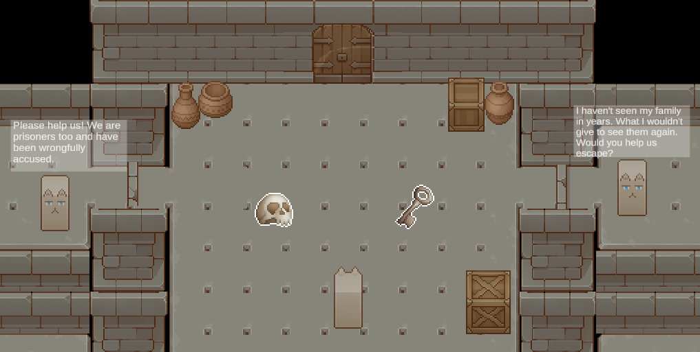

# Prison Break

Welcome to Prison Break, an environmental affinity game created by Franceso Petrini, Udit Chophla, and Payal Kulkarni. Being an environmental affinity game, Prison Break provides minimal guidance and leverages the environment, itself, the convey possible user choices. Every choice in our game modifies the game environment and has consequences for how the playthrough can continue. Ultimately, our goal is to record user behavior and their affinity towards violence or pacificsm. We hope this game can be used for future work at the intersection of computer science and psychology, where we can track user characteristics such as age, gender, major or profession, etc. and how these characteristics impact their decision making in the game.

<h3>Tools & Technologies</h3>
This game was developed with Unity, which is a requirement in order to run and play the game. Once the project is cloned onto your machine, you can use the Unity hub to directly open the folder and launch the game. Then open the "SampleScene" scene in Unity to play the main part of the game. You can download Unity here: https://unity.com/download

<h3>Controls</h3>
<ul>
  <li>Use either the arrow keys or W,A,S,D to move around.</li> 
  <li>Press E to interact witht environmental objects.</li>
  <li>Press spacebar to attack with hammer or shoot the gun if any of these weapons are equipped.</li>
</ul>

<h3>Screenshots</h3>

<h3>Video Demo</h3>
https://drive.google.com/file/d/1zVLKBmsjcU9HPe3yGD2vD9cZ_y61AMzW/view?usp=sharing
